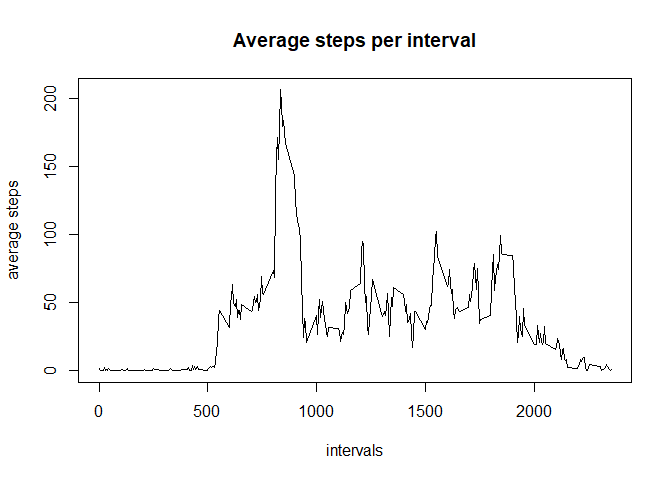

## Loading and preprocessing the data

```r
unzip("activity.zip")

df <- read.csv("activity.csv")

df$date <- as.Date(df$date)
```

## What is mean total number of steps taken per day?

1. Calculate total number of steps taken per day

```r
totalsteps <- with(df, tapply(steps, date, sum, na.rm = TRUE))
```


2. Make a histogram of total steps per day

```r
hist(totalsteps, xlab = "Total steps", ylab = "frequency", main = "Total steps per day")
```

<!-- -->


3. Calculate the mean and median of the total number of steps

Mean

```r
print(stepsMean <- mean(totalsteps))
```

```
## [1] 9354.23
```

Median

```r
print(stepsMedian <- median(totalsteps))
```

```
## [1] 10395
```

## What is the average daily activity pattern?

Make time series plot with average steps across all days

```r
avsteps <- with(df, tapply(steps, interval, mean, na.rm = TRUE))
with(df, plot(unique(interval), avsteps, type = "l",
              xlab = "intervals", ylab = "average steps", main = "Average steps per interval"))
```

<!-- -->


Which interval has maximum steps?

```r
df[which.max(avsteps),]$interval
```

```
## [1] 835
```
interval 835 contains maximum average steps per day

## Imputing missing values

Total number of missing values

```r
sum(is.na(df$steps))
```

```
## [1] 2304
```
A new data frame made using filled in missing values
missing values will be filled in by using average steps taken in that interval

```r
dfnew <- data.frame("steps" = df$steps, "date" = df$date, "interval" = df$interval)

for(i in 1:length(dfnew$steps)){
        if(is.na(dfnew$steps[i])){
                index <- as.character(dfnew$interval[i])
                dfnew$steps[i] <- avsteps[index]
        }
}
```
Total steps using the data frame without missing values

```r
totalstepsnew <- with(dfnew, tapply(steps, date, sum, na.rm = TRUE))
```
Make a histogram of total steps per day without missing values

```r
hist(totalstepsnew, xlab = "Total steps", ylab = "frequency", main = "Total steps per day")
```

<!-- -->


3. Calculate the mean and median of the total number of steps

Mean

```r
print(stepsMean <- mean(totalstepsnew))
```

```
## [1] 10766.19
```
Median

```r
print(stepsMedian <- median(totalstepsnew))
```

```
## [1] 10766.19
```
There is an increase in the average steps taken per day by filling in the missing values
However, there is only a slight increase in the median
Interesting to note that after filling in missing values both the mean and median are equal


## Are there differences in activity patterns between weekdays and weekends?

Make new data frame with a factor variable indicating a weekday or weekend

```r
week <- NULL
for(x in 1:length(dfnew$date)){
        day <- weekdays(dfnew$date[x])
        if(day == "Saturday" | day == "Sunday"){
                factorname <- "weekend"
        }
        else {
                factorname <- "weekday"
        }
        
        week <- c(week , factorname)
        
}

dfnew <- cbind(dfnew, week)
```
Make time series plot for average steps across weekdays and weekends

```r
weekdaydf <- subset(dfnew, dfnew$week == "weekday")
weekenddf <- subset(dfnew, dfnew$week == "weekend")

weekdayavsteps <- with(weekdaydf, tapply(steps, interval, mean, na.rm = TRUE))
weekendavsteps <- with(weekenddf, tapply(steps, interval, mean, na.rm = TRUE))


par(mfrow = c(2,1), mar = c(4,4,2,1))

with(weekdaydf, plot(unique(interval), weekdayavsteps,
                     type = "l", main = "Weekday", xlab = "intervals", ylab = "Average steps"))
with(weekenddf, plot(unique(interval), weekendavsteps,
                     type = "l", main = "Weekend", xlab = "intervals", ylab = "Average steps"))
```

<!-- -->

